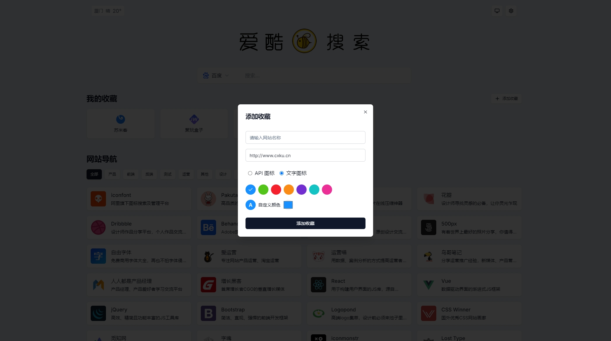
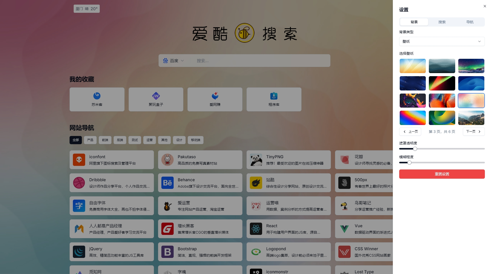

<p align="center">
  <a href="https://www.icoolgo.com" target="_blank">
    
  </a>
</p>


<h3 align="center">Open Source PM-Navigator · Tab Page · Search · Custom Navigation </h3>
<p align="center">Developed using Cursor, the website provides URL navigation with support for customizing the homepage style, URLs, and interfaces</p>

<p align="center"> <a href="README-CN.md">中文</a> |  English | <a href="https://www.icoolgo.com/" target="_blank">DEMO</a></p>

## About

A website navigation site developed using the AI programming tool Cursor, with built-in navigation API, support for customizing the homepage style, search engines, website bookmarks, etc.

<p align="center">
  <a href="" >
    
  </a>
</p>

<p align="center">
  <a href="" >
    
  </a>
</p>

<p align="center">
  <a href="" >
    
  </a>
</p>
## 🚀 Features

1. **Simple and practical**: The default URL navigation function, you can add your own URL favorites by customizing.
2. **Multiple Layouts**: Customize the style of your page, as well as the way your navigation cards are laid out.
3. **Perfect Function**: In addition to the navigation function, it also supports the customization of page elements, mode switching, etc.

## 🚀 Already functional

- Built-in multiple search engine switching
- My Favorites (support adding favorites)
- URL navigation (built-in navigation API common to product managers)
- Link/version information (custom via API)
- Mode switching (System/Light/Dark)
- Settings page (background wallpaper/search engine/navigation style)
- Three background wallpaper styles (solid color/gradient/wallpaper support set mask, wallpaper blur)
- Search engine settings (default search, icon/text display, search engine switch, search box style)
- Navigation icon styles (large icons, small icons, card style)

## 🚀 Future Feature Plan

- Add search keyword history, you can clear the search history with one click
- Added the URL navigation management function, which can directly manage the commonly used URL navigation in the API after logging in
- Added search engine add feature, add custom search engine
- Added the function of importing URLs in batches, and supported one-click import of common browser bookmark HTML files
- Add the list of hot searches, and call the latest hot searches through API [Weibo, Hupu, Zhihu, Baidu, 360]

## 📦 Installation & Deployment

### Using Node.js

For local development or deployment on a Node.js server:

Clone the repository:

```
git clone https://github.com/xmsumi/icoolgo-pm-navigator.git
cd icoolgo-pm-navigator
```

Install dependencies:

```
npm install
# or
yarn install
# or
pnpm install
```

Run the development server:

```
npm run dev
# or
yarn dev
# or
pnpm dev
```

Open [http://localhost:3000](http://localhost:3000/) in your browser to see the application.

For production deployment:

```
# Build the application
npm run build

# Start the production server
npm start
```

## License

Licensed under the [MIT](./LICENSE) License.